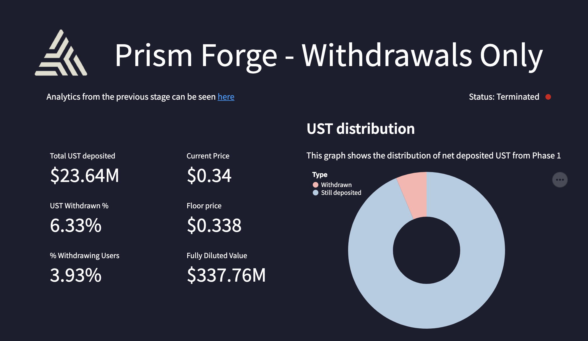
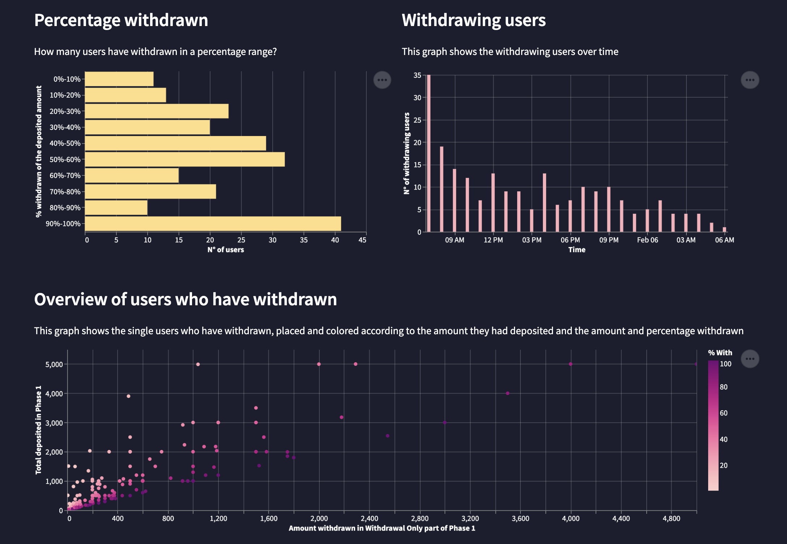

# Prism Forge - Dashboard

[Prism Protocol](https://prismprotocol.app/) is a decentralized application developed on the Terra blockchain which allows to refract tokens into their principal and yield components.

This repository contains the code used to develop the dashboard visualising the data from the Prism Forge - the launch event of the $PRISM token.

The dashboard uses mainly Streamlit (for the website), Pandas (data manipulation) and Altair (data viz).

The project has been supported by [flipside](https://flipsidecrypto.xyz/)

* The dashboard for the deposit phase can be found [here](https://share.streamlit.io/incioman/prism_forge/streamlit_app_phase1_deposit.py) (if it is still online)

* The dashboard for the withdrawal phase can be found [here](https://share.streamlit.io/incioman/prism_forge) (if it is still online)

In case the websites are not online anymore, here are some screenshots of the dashboard

You can see the official Tweet announcing the dashboard [here](https://twitter.com/flipsidecrypto/status/1488537679046352896?s=20&t=fEBu1vCFU1lG2pYG3iaWHQ).